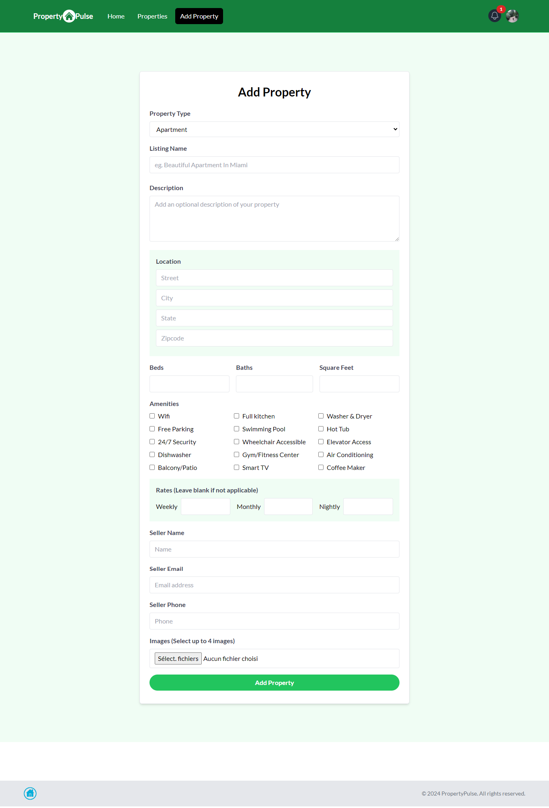

# Property Pulse
.png)

## Description
This is a project based course that will teach you how to use Next.js in the real world. We use all of the latest features in Next 14 to build a property rental website where users can browse, search and manage property listings.

## Features
User authentication with Google & Next Auth

User authorization

RESTful API routes

Route protection

User profile with user listings

Property Listing CRUD

Property image upload (Multiple)

Cloudinary integration

Property search

Internal messages with 'unread' notifications

Photoswipe image gallery

Mapbox maps

Toast notifications

Property bookmarking / saved properties

Property sharing to social media

Loading spinners

Responsive design (Tailwind)

Custom 404 page

## Overview

